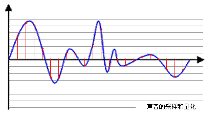

# 基本音频知识

## 采样率
Sample rate 由于音频是连续的信号，采样率是每秒从连续信号中提取并组成离散信号的采样个数，用赫兹Hz来表示  
简单来说是每秒在每个声道上采样的个数  
  
蓝色代表音频信号 红色就是采样点的值 **采样率越高 红色就越密集 纪录信号的信息量越大 音频质量就越高**  
常用的采样率是：8kHz、11.025kHz、22.05kHz、16kHz、37.8kHz、44.1kHz、48kHz、96kHz、192kHz  
赫兹的单位是次/s  16kHz就是每秒采样16000次  

## 位深度
每次采集声音数据的大小 单位为bit 就是上面每一个红色的点的采样用几个bit来表示  
有4bits, 8bits, 16bits, 32bits等等 位数越多表示得就越精细 声音质量就越好  

## 声道数
由于音频的采集和播放是可以叠加的，因此，可以同时从多个音频源采集声音，并分别输出到不同的扬声器  
单声道（Mono）和双声道（Stereo）比较常见 前者的声道数为1，后者为2  

## 比特率
一秒采集的数据大小(bits) = 一秒采样的点的个数 * 一个点的bit数 * 通道数 = 采样率 * 位深度 * 通道数  
这就是比特率 bps  

## 音频帧
音频帧和视频不一样 视频每一帧就是一张图像，音频数据是流式的，本身没有明确的一帧帧的概念，为了音频算法处理/传输的方便，一般约定俗成取2.5ms~60ms为单位的数据量为一帧音频 这又被称为"**采样时间**"   
一帧的采样数据大小(bits) = 一帧的时间 * 一秒的采样点个数 * 一个点的bit数 * 位深度 * 通道数  
也有另一种定义视频帧的算法 就是一帧内要采样多少个点 根据采样率就可以算出一帧的播放时间  
如AAC采样率44100 一帧如果包含1024个采样点 那么一帧的时间就是 1024 / 44100 = 23.22ms  

